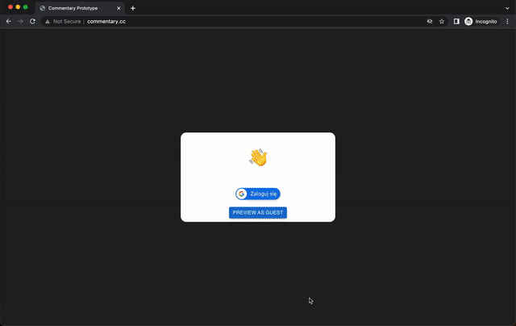
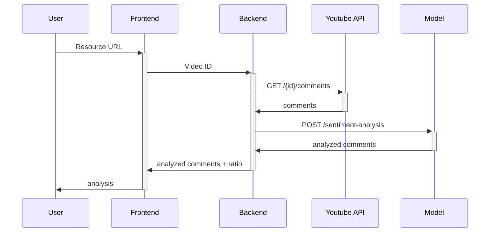

# Commentary

## What's this all about.

Startup idea, uploaded cause I won't reach the audience that I want to. 

The problem was that as the project was targeted for polish youtubers (as model is now trained only for polish language, as I thought that there's a niche for that), and they are hard to contact with if you do not have an audience. 

I learned so much doing this project that I know the next one will be better. 
- I revised `python`, `flask` and `postgres` as both [backend](backend/README.md) and [model](bert-model/README.md) are using this tools.
- Reaserched, developed and trained ML model to evaluate sentiment for polish language. 
- Did my part on frontend side using `React`, `Typescript` and [Svelte](bert-model/data/evaluation/frontend/README.md) (miniproject for easier comments evaluation)
- Learned some `docker` and how models and `networking works in containers`
- Learned some `nginx` to properly host a site.
- **First time hosted app on my own machine** (as a service on `linode.com`)
- **First time reached out to potential customers**
- and much more

## Demo

Gif showing how app is working:

Diagram on how things work:

It was hosted under [this link](www.commentary.cc), however for saving money purposes I will (or torn it down by the end of March 2023).

## Conclusion
I don't consider it a failure or waste of time. I had a great time and learned much more than I expected. 
Now I will just think on a better idea. 
