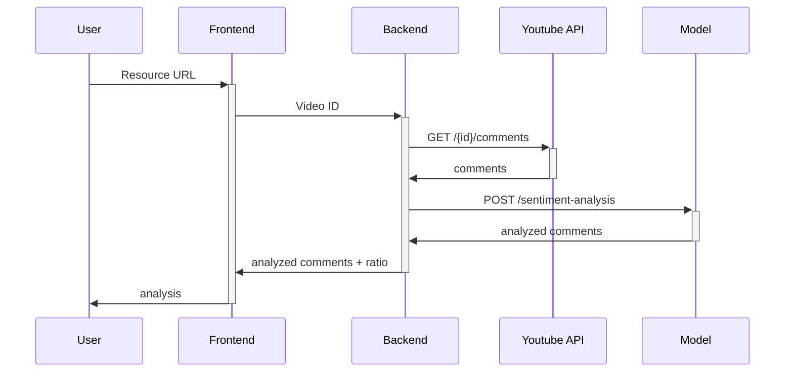

# Commentary

## What's this all about.

Startup idea, aiming polish content creators for easier comments sentiment evaluation and analyzing positive/neutral/negative viewers reviews.

The problem was that as the project was targeted for polish youtubers (as model is now trained only for polish language, as I thought that there's a niche for that), and they are hard to contact with if you do not have an audience. 

## Technologies used

Using pyenv, as tensorflow doesn't have stable version for python version > 3.10.9

### ML Model 
Project based on Flask and Transformers library to train model. 
I used Bert Model (pretrained `kleczek/bert-base-polish-cased-v1`), trained further with my own datasets, as it was in my opinion best suited for the case like this. 

- Python
- Flask
- Transformers
- Docker
- Svelte (small app for manual sentiment evaluation)

### Backend 
Simple API to analyze comments and communication with DB and youtube api. Analyzing comments using calls to `bert-model` api.

- Python
- Flask
- Postgres
- Docker
- YouTube API

### Frontend 
Simple app allowing users to log in using Google or preview as guest. Using MaterialUI for simplifying user interface and speeding up developing process.

- React
- Typescript
- MaterialUI
- Vite

### Deployment
To simplify deployment process used Docker Compose and nginx.

## Demo

<!--  -->

  
<em>Gif showing how app is working</em>

*Diagram on how things work*

## TBD
App is working as I envisioned it, however it still have some minor flaws and issues. Things that can be improved:
- User Interface design
- ML Model accuracy (local PC is too weak to train model properly)
- Response time on resource analysis.

Model accuracy as for now stands on about __65%__, could be further improved if trained with more data/more epochs. 